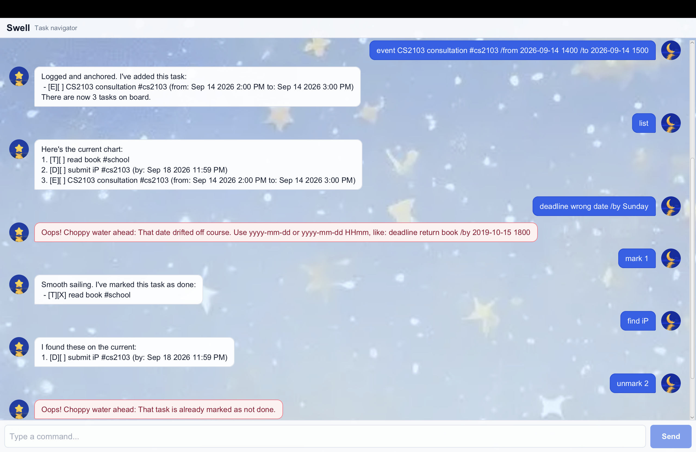

# Swell User Guide

Swell is a desktop task chatbot that helps you track todos, deadlines, events, and tags with short text commands.
It speaks like a calm task navigator, but keeps the workflow simple and predictable.



When Swell starts, it greets you with:

```text
Hi, I'm Swell, your calm task navigator.
Send me a task, and we'll chart a steady course.
```

## Quick Start

Type a command into the input box and press `Enter` or click `Send`.
Swell saves your tasks automatically, so your task list will still be there the next time you open the app.

A simple first session can look like this:

```text
todo read book
deadline submit report /by 2026-09-18 2359
event project meeting /from 2026-09-19 1400 /to 2026-09-19 1600
list
```

## Command Format

Swell reads commands in this general format:

```text
COMMAND DETAILS
```

Use one command word at the start, followed by the details needed for that command.
Extra spaces at the start or end are accepted.

Correct:

```text
todo read book
mark 1
delete 2
```

Incorrect:

```text
read book
mark
delete two
```

The first example is missing a supported command word.
The second example is missing a task number.
The third example uses a word instead of a positive whole number.

## Dates and Times

Deadlines and events accept dates in either of these formats:

```text
YYYY-MM-DD
YYYY-MM-DD HHmm
```

Correct:

```text
2026-09-18
2026-09-18 2359
```

Incorrect:

```text
18-09-2026
2026/09/18
2026-09-18 23:59
Sunday
2026-02-30
```

Use a real calendar date. For a time, use four digits without a colon.

## Tags

Tags help you group related tasks.
When adding a tag to a task, start the tag with `#`.
Tags can contain letters, numbers, hyphens, or underscores.

Correct:

```text
todo email Alice #followup
deadline submit report #cs2103 /by 2026-09-18
event project meeting #team_sync /from 2026-09-19 1400 /to 2026-09-19 1600
```

Incorrect:

```text
todo email Alice #follow up
todo email Alice #
deadline submit report /by 2026-09-18 #cs2103
```

Use one word per tag.
For deadlines, place tags before `/by`.
For events, place tags before `/from`.

## Add a Todo

Use `todo` for a task without a date or time.

Format:

```text
todo DESCRIPTION [#TAG]...
```

Examples:

```text
todo read book
todo email Alice #followup
```

Swell replies with the added task and the updated task count.

Common mistakes:

```text
todo
```

This is missing the task description. Use something like:

```text
todo read book
```

## Add a Deadline

Use `deadline` for a task that must be completed by a specific date or date-time.

Format:

```text
deadline DESCRIPTION [#TAG]... /by DATE
```

Examples:

```text
deadline submit report /by 2026-09-18
deadline submit report #cs2103 /by 2026-09-18 2359
```

Use `/by` exactly once.

Common mistakes:

```text
deadline submit report
deadline submit report /by
deadline /by 2026-09-18
deadline submit report /by Sunday
deadline submit report /by 2026-09-18 /by 2026-09-19
```

These commands are missing `/by`, missing the date, missing the description, using an unsupported date format, or using `/by` more than once.

## Add an Event

Use `event` for a task that happens during a period of time.

Format:

```text
event DESCRIPTION [#TAG]... /from START /to END
```

Examples:

```text
event project meeting /from 2026-09-19 1400 /to 2026-09-19 1600
event quick sync #team /from 2026-09-19 /to 2026-09-19
```

Use `/from` exactly once and `/to` exactly once.
The start and end may be the same if the event happens at one point in time.

Common mistakes:

```text
event project meeting /from 2026-09-19 1400
event project meeting /to 2026-09-19 1600
event /from 2026-09-19 1400 /to 2026-09-19 1600
event project meeting /from Monday 2pm /to Tuesday 3pm
event project meeting /from 2026-09-19 1400 /from 2026-09-20 1400 /to 2026-09-20 1600
```

These commands are missing `/to`, missing `/from`, missing the description, using unsupported date-time formats, or using `/from` more than once.

## List Tasks

Use `list` to view all saved tasks.

Format:

```text
list
```

Example response:

```text
Here's the current chart:
1. [T][ ] read book #school
2. [D][ ] submit report #cs2103 (by: Sep 18 2026 11:59 PM)
```

If there are no tasks, Swell will tell you the task list is empty.

## Mark and Unmark Tasks

Use `mark` when a task is done.
Use `unmark` when a completed task should be set back to not done.

Formats:

```text
mark TASK_NUMBER
unmark TASK_NUMBER
```

Examples:

```text
mark 1
unmark 1
```

Common mistakes:

```text
mark
mark 0
mark one
mark 1 2
unmark 999
```

Use one positive whole number only.
The number must refer to a task currently shown in your task list.
Swell will also warn you if you try to mark a completed task again or unmark a task that is already not done.

## Delete a Task

Use `delete` to remove a task from the list.

Format:

```text
delete TASK_NUMBER
```

Example:

```text
delete 2
```

Swell will show the removed task and the updated task count.

Common mistakes:

```text
delete
delete 0
delete one
delete 1 2
delete 999
```

Use one positive whole number only.
The number must refer to an existing task.

## Find Tasks by Keyword

Use `find` to search task descriptions.

Format:

```text
find KEYWORD
```

Examples:

```text
find report
find project meeting
```

The search is case-insensitive.

Common mistakes:

```text
find
```

This is missing the keyword to search for.

## Find Tasks by Tag

Use `findtag` to search tasks by tag.

Format:

```text
findtag TAG
```

Examples:

```text
findtag cs2103
findtag #school
```

You may include or omit `#` when searching for a tag.

Common mistakes:

```text
findtag
findtag follow up
findtag #
findtag @school
```

Use one tag only.
The tag must contain letters, numbers, hyphens, or underscores.

## Exit Swell

Use `bye` when you are done.

Format:

```text
bye
```

Swell replies:

```text
Docking for now. Come back when you're ready to set sail again.
```

## Error Messages

If a command is missing information or uses an unsupported format, Swell explains the problem and gives a working example.
In the GUI, errors are shown with a different style so they are easier to notice.

Example:

```text
todo
```

Swell replies:

```text
Oops! Choppy water ahead: A todo needs cargo to carry. Try: todo read book
```

Here are the main error types Swell handles:

Unsupported command:

```text
add read book
```

Use one of the supported commands instead: `todo`, `deadline`, `event`, `list`, `find`, `findtag`, `mark`, `unmark`, `delete`, or `bye`.

Missing description:

```text
todo
deadline /by 2026-09-18
event /from 2026-09-19 /to 2026-09-20
```

Add a task description after the command word.

Missing required prefix:

```text
deadline submit report
event project meeting /from 2026-09-19
event project meeting /to 2026-09-19
```

Use `/by` for deadlines. Use both `/from` and `/to` for events.

Repeated required prefix:

```text
deadline submit report /by 2026-09-18 /by 2026-09-19
event meeting /from 2026-09-19 /from 2026-09-20 /to 2026-09-20
```

Use each required prefix exactly once.

Invalid date or time:

```text
deadline submit report /by 2026-02-30
deadline submit report /by 2026-09-18 23:59
event meeting /from Monday 2pm /to Tuesday 3pm
```

Use `YYYY-MM-DD` or `YYYY-MM-DD HHmm`.

Invalid task number:

```text
mark 0
mark one
delete 1 2
```

Use one positive whole number that exists in your task list.

Invalid tag:

```text
findtag
findtag follow up
findtag #
findtag @school
```

Use a single tag such as `school`, `#school`, `cs2103`, or `follow_up`.

## Command Summary

```text
todo DESCRIPTION [#TAG]...
deadline DESCRIPTION [#TAG]... /by YYYY-MM-DD [HHmm]
event DESCRIPTION [#TAG]... /from YYYY-MM-DD [HHmm] /to YYYY-MM-DD [HHmm]
list
mark TASK_NUMBER
unmark TASK_NUMBER
delete TASK_NUMBER
find KEYWORD
findtag TAG
bye
```
