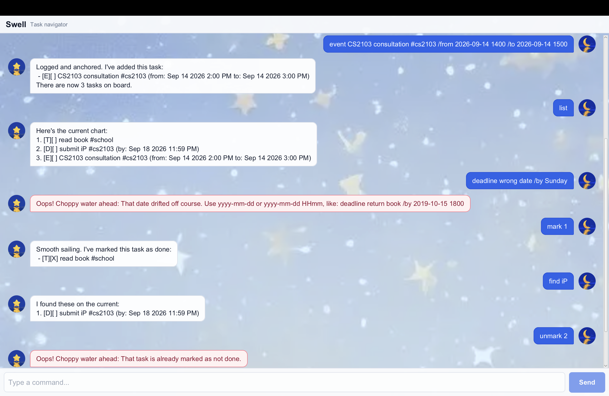

# Swell User Guide

Swell is a desktop task chatbot for keeping track of todos, deadlines, events, and tags. It is designed for users who prefer entering short commands while retaining the convenience of a graphical chat interface.



## Quick Start

1. Ensure that Java `25` or later is installed on your computer.
1. Download the latest `swell.jar`. If you have the project source instead, create it by running:

    ```sh
    ./gradlew shadowJar
    ```

    The file is created at `build/libs/swell.jar`.

1. Copy `swell.jar` to the folder you want to use as Swell's home folder. Swell stores its data in this folder.
1. Open a terminal in that folder and run:

    ```sh
    java -jar swell.jar
    ```

Swell displays a greeting when it is ready. Type a command in the input box and press <kbd>Enter</kbd>, or select **Send**. Refer to [Features](#features) for the complete command reference.

## Features

### Command format

- Commands and their prefixes must be typed in lowercase. For example, use `todo`, not `TODO`, and `/by`, not `/BY`.
- Words in `UPPER_CASE` are values you supply. For example, in `todo DESCRIPTION`, replace `DESCRIPTION` with a task such as `read book`.
- Items in square brackets are optional. For example, `todo DESCRIPTION [#TAG]...` can be used as either `todo read book` or `todo read book #school`.
- `...` means the preceding item can appear zero or more times. For example, a task can have no tags, one tag, or several tags.
- Task numbers are positive integers (`1`, `2`, `3`, ...). They refer to the number displayed by `list`.
- Swell accepts dates as `YYYY-MM-DD`, or dates and times as `YYYY-MM-DD HHmm`. Use four digits for the time and do not include a colon.
- Leading and trailing spaces are ignored. The order of the required parts of `deadline` and `event` commands is fixed.

### Adding a todo: `todo`

Adds a task without a date or time.

Format: `todo DESCRIPTION [#TAG]...`

Examples:

- `todo read book`
- `todo email Alice #followup`
- `todo revise notes #cs2103 #urgent`

Each tag begins with `#` and may contain letters, numbers, hyphens, or underscores. Duplicate tags, including tags that differ only in letter case, are stored once.

### Adding a deadline: `deadline`

Adds a task that must be completed by a date or date-time.

Format: `deadline DESCRIPTION [#TAG]... /by DATE [HHmm]`

Examples:

- `deadline submit report /by 2026-09-18`
- `deadline submit report #cs2103 /by 2026-09-18 2359`

- Use `/by` exactly once.
- Put tags before `/by`.
- `DATE` must be a real calendar date. For example, `2026-02-30` is not valid.

### Adding an event: `event`

Adds a task that takes place from a start date or date-time to an end date or date-time.

Format: `event DESCRIPTION [#TAG]... /from START [HHmm] /to END [HHmm]`

Examples:

- `event project meeting /from 2026-09-19 1400 /to 2026-09-19 1600`
- `event quick sync #team /from 2026-09-19 /to 2026-09-19`

- Use `/from` exactly once and `/to` exactly once.
- Put tags before `/from`.
- Start and end values can be dates only, dates and times, or a combination of both.

### Listing all tasks: `list`

Displays every saved task and its task number.

Format: `list`

Example output:

```text
Here's the current chart:
1. [T][ ] read book #school
2. [D][ ] submit report #cs2103 (by: Sep 18 2026 11:59 PM)
3. [E][X] project meeting #team (from: Sep 19 2026 2:00 PM to: Sep 19 2026 4:00 PM)
```

`[T]`, `[D]`, and `[E]` identify todo, deadline, and event tasks respectively. `[ ]` means the task is not done; `[X]` means it is done. If there are no tasks, Swell reports that the list is empty.

### Finding tasks by description: `find`

Displays tasks whose descriptions contain the given text.

Format: `find KEYWORD`

Examples:

- `find report`
- `find project meeting`

The search is case-insensitive and searches descriptions only. It matches text within a description, so `find meet` matches a task named `project meeting`.

### Finding tasks by tag: `findtag`

Displays tasks with the specified tag.

Format: `findtag TAG`

Examples:

- `findtag cs2103`
- `findtag #school`
- `findtag team_sync`

You may include or omit the leading `#` when searching. Tag matching is case-insensitive.

### Marking a task as done: `mark`

Marks the specified task as complete.

Format: `mark TASK_NUMBER`

Example: `mark 1`

The task number must refer to an existing task in the full list. Swell reports an error if the task is already marked as done.

### Marking a task as not done: `unmark`

Marks a completed task as not done.

Format: `unmark TASK_NUMBER`

Example: `unmark 1`

The task number must refer to an existing task in the full list. Swell reports an error if the task is already not done.

### Deleting a task: `delete`

Removes the specified task permanently.

Format: `delete TASK_NUMBER`

Example: `delete 2`

The task number must refer to an existing task in the full list. Swell confirms the removed task and the number of tasks remaining.

### Exiting Swell: `bye`

Ends the current Swell session and disables further input in the application window.

Format: `bye`

### Saving data

Swell saves the task list automatically whenever you add, mark, unmark, or delete a task. You do not need to save manually. Your tasks are loaded automatically when Swell next starts from the same home folder.

### Editing the data file

Swell stores task data in `data/swell.txt` inside its home folder.

> **Caution:** Edit this file only if you understand its format. If any saved task is invalid, Swell shows an error and starts with an empty task list for that session. The original file remains until a later task-changing command overwrites it, so back up the file before making manual changes.

## Command Summary

| Action              | Format                                                          | Example                                                                 |
| ------------------- | --------------------------------------------------------------- | ----------------------------------------------------------------------- |
| Add todo            | `todo DESCRIPTION [#TAG]...`                                    | `todo read book #school`                                                |
| Add deadline        | `deadline DESCRIPTION [#TAG]... /by DATE [HHmm]`                | `deadline submit report #cs2103 /by 2026-09-18 2359`                    |
| Add event           | `event DESCRIPTION [#TAG]... /from START [HHmm] /to END [HHmm]` | `event project meeting #team /from 2026-09-19 1400 /to 2026-09-19 1600` |
| List all tasks      | `list`                                                          | `list`                                                                  |
| Find by description | `find KEYWORD`                                                  | `find report`                                                           |
| Find by tag         | `findtag TAG`                                                   | `findtag #school`                                                       |
| Mark task done      | `mark TASK_NUMBER`                                              | `mark 1`                                                                |
| Mark task not done  | `unmark TASK_NUMBER`                                            | `unmark 1`                                                              |
| Delete task         | `delete TASK_NUMBER`                                            | `delete 2`                                                              |
| Exit Swell          | `bye`                                                           | `bye`                                                                   |
